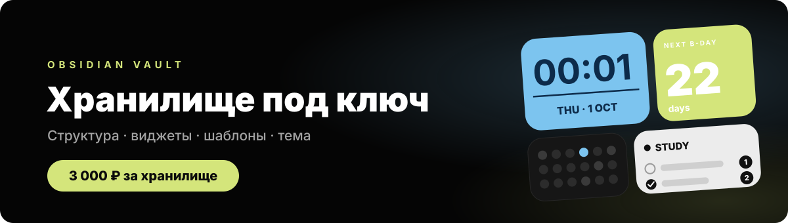
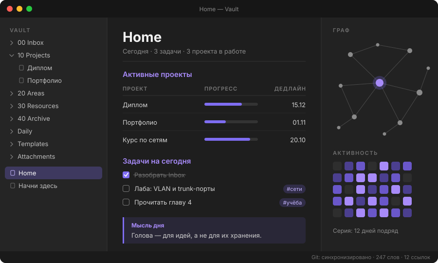
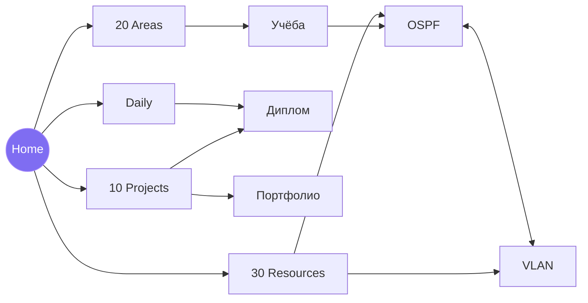

<div align="center">



<br>

**Настроенное хранилище Obsidian — такого же объёма и устройства, как моё.<br>Открыл и пишешь.**

<br>


[Что входит](#-что-входит) · [Примеры](#-примеры) · [Цена](#-цена) · [Заказать](#-как-заказать) · [FAQ](#-faq)

</div>

---

## ⚡ Коротко

Obsidian бесплатный и мощный, но пустое хранилище — это чистый лист и неделя настройки: какие папки, какие плагины, как связать заметки, чтобы через месяц не утонуть в них.

Я делаю это за тебя. Ты получаешь хранилище того же объёма и устройства, что у меня: структура, шаблоны, плагины, дашборд и оформление уже настроены и связаны между собой.

> [!IMPORTANT]
> В репозитории **нет самого хранилища** — только описание и примеры. Каждое хранилище собирается под конкретного заказчика и передаётся лично.

## 📦 Что входит

| | |
|:--|:--|
| 🗂 **Структура** | Система PARA: Inbox → Projects → Areas → Resources → Archive, плюс Daily, Templates, Attachments |
| 📝 **Шаблоны** | 8 шт.: день, неделя, проект, конспект, встреча, книга/курс, человек, карта темы (MOC) |
| 🧩 **Плагины** | 13 проверенных плагинов сообщества — установлены и настроены ([список](#-плагины)) |
| 🏠 **Дашборд** | Главная страница: проекты, задачи на сегодня, недавние заметки, активность |
| ✅ **Задачи** | Задачи прямо в заметках: сроки, повторы, общая сводка по всем проектам |
| 🎨 **Оформление** | Тёмная тема, CSS-сниппеты, иконки папок, аккуратные callout-блоки |
| ⌨️ **Горячие клавиши** | Новая заметка, захват в Inbox, поиск, переход к сегодняшнему дню |
| 🔄 **Синхронизация** | Автобэкап через Git + инструкция для Syncthing / iCloud |
| 📖 **«Начни здесь»** | Заметка-инструкция: как пользоваться хранилищем за 10 минут |

### 🗂 Структура

```text
📁 Vault
├── 🏠 Home.md            ← дашборд, открывается при запуске
├── 📖 Начни здесь.md     ← инструкция
├── 00 Inbox/             ← всё новое падает сюда
├── 10 Projects/          ← то, у чего есть срок и результат
├── 20 Areas/             ← учёба, работа, здоровье, финансы
├── 30 Resources/         ← конспекты, статьи, книги, курсы
├── 40 Archive/           ← завершённое
├── Daily/                ← дни и недели
├── Templates/            ← шаблоны
├── Attachments/          ← картинки и PDF отдельно от текста
└── .obsidian/            ← плагины, тема, горячие клавиши
```

### 🧩 Плагины

| Плагин | Зачем |
|:--|:--|
| **Dataview** | таблицы и списки из заметок — основа дашборда |
| **Templater** | шаблоны с датами и подстановками |
| **Tasks** | задачи со сроками и повторами из любой заметки |
| **Periodic Notes** + **Calendar** | день и неделя в один клик |
| **Homepage** | при запуске сразу открывается Home |
| **QuickAdd** | мысль → Inbox за пару секунд |
| **Omnisearch** | полнотекстовый поиск, прощает опечатки |
| **Kanban** | доски для проектов |
| **Excalidraw** | схемы и рисунки прямо в заметках |
| **Obsidian Git** | автобэкап в приватный репозиторий |
| **Iconize** | иконки папок и заметок |
| **Style Settings** | тонкая настройка темы без кода |

## 👀 Примеры

<div align="center">

<br><sub>Главная страница: проекты, задачи, граф связей и активность</sub>
</div>

<br>

<details open>
<summary><b>Конспект с callout-блоками</b></summary>

```markdown
# OSPF

> [!summary] Суть
> Link-state протокол маршрутизации: каждый роутер строит карту сети
> и считает кратчайшие пути алгоритмом Дейкстры.

> [!tip] Запомнить
> Cost = reference bandwidth / bandwidth интерфейса.

Связано: [[Маршрутизация]] · [[Алгоритм Дейкстры]] · [[CCNA]]
```

</details>

<details>
<summary><b>Шаблон ежедневной заметки (Templater)</b></summary>

```markdown
---
date: <% tp.date.now("YYYY-MM-DD") %>
tags: [daily]
---
# <% tp.date.now("dddd, D MMMM") %>

← [[<% tp.date.now("YYYY-MM-DD", -1) %>]] · [[<% tp.date.now("YYYY-MM-DD", 1) %>]] →

## 🎯 Главное на сегодня
- [ ] 

## 📥 Заметки дня
- 

## 🌙 Итоги
- Что получилось:
- Что улучшить:
```

</details>

<details>
<summary><b>Dataview: активные проекты на дашборде</b></summary>

```dataview
TABLE status AS "Статус", deadline AS "Дедлайн"
FROM "10 Projects"
WHERE status = "в работе"
SORT deadline ASC
```

</details>

<details>
<summary><b>Tasks: всё, что горит сегодня</b></summary>

```tasks
not done
due before tomorrow
sort by due
group by filename
```

</details>

<details>
<summary><b>Как связаны заметки</b></summary>



</details>

## 💰 Цена

<div align="center">

| Хранилище под ключ | |
|:--|:--:|
| Структура, шаблоны, плагины, дашборд, оформление | ✓ |
| Объём и устройство — как у моего хранилища | ✓ |
| Разделы под твои предметы и проекты | ✓ |
| Синхронизация и инструкция «Начни здесь» | ✓ |
| **Итого** | **3 ₽** |

</div>

## 🛒 Как заказать

1. **Оставь заявку** — [открой Issue по форме «Заказ»](https://github.com/mitaro-cs/obsidian/issues/new?template=order.yml): для чего хранилище, какие разделы, какие устройства.
2. **Оплати 3 ₽** — реквизиты пришлю в ответ на заявку.
3. **Получи хранилище** — архив с готовой папкой. Распаковал → Obsidian → «Открыть папку как хранилище».

> [!NOTE]
> Issues видны всем — не оставляй в заявке телефон и другие личные данные.

## ❓ FAQ

<details>
<summary><b>Зачем платить, если Obsidian бесплатный?</b></summary>
<br>
Платишь не за Obsidian, а за часы настройки: структура, плагины, шаблоны и связи уже продуманы и проверены на практике.
</details>

<details>
<summary><b>Почему здесь нет самого хранилища?</b></summary>
<br>
Это витрина. Хранилище собирается под каждого заказчика и передаётся лично, поэтому в открытом доступе его нет.
</details>

<details>
<summary><b>Будет работать на телефоне?</b></summary>
<br>
Да. Хранилище — обычная папка с Markdown-файлами, а Obsidian есть на Android и iOS. Почти все плагины работают и там.
</details>

<details>
<summary><b>Не будет привязки к сервису?</b></summary>
<br>
Нет. Все заметки — обычные <code>.md</code>-файлы, которые открываются любым редактором. Никаких подписок.
</details>

<br>

<div align="center">
<sub>Сделано в Obsidian · заметки в Markdown навсегда</sub>
</div>
