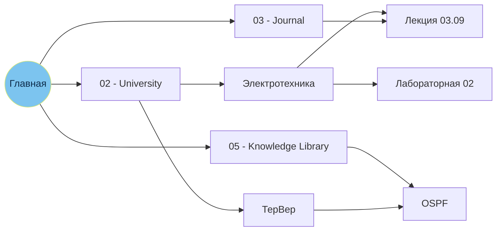

<div align="center">


<br>

**Хранилище Obsidian с тем же устройством, что у меня: разделы, Главная с виджетами, шаблоны и тема.<br>Открыл и пользуешься.**

<br>


<a href="https://t.me/treadways"></a>


[Что входит](#-что-входит) · [Примеры](#-примеры) · [Цены](#-цены) · [Заказать](#-как-заказать) · [FAQ](#-faq)

</div>

---

## ⚡ Коротко

Пустой Obsidian — это чистый лист и недели настройки: какие разделы, какие плагины, как собрать дашборд, чтобы им реально хотелось пользоваться.

Ты получаешь копию устройства моего хранилища (до 300 заметок): те же 9 разделов, та же Главная с виджетами, те же шаблоны и оформление. **Без моих заметок** — наполняешь своими.

> [!IMPORTANT]
> В репозитории **нет самого хранилища** — только описание и примеры. Хранилище передаётся лично после оплаты.

## 📦 Что входит

| | |
|:--|:--|
| 🏠 **Главная** | Дашборд из виджетов: часы и дата, день года, календарь заметок за месяц, ближайший день рождения, учёба на неделю, недавние заметки |
| 🎓 **Учёба** | Предметы с лекциями, практиками и лабораторными, метки LEC · PRA · LAB, прогресс за неделю |
| 🗂 **Структура** | 9 разделов с иконками — от Personal и University до Knowledge Library и Information Base |
| 📝 **Шаблоны** | Готовые заготовки на Templater: новая заметка создаётся уже с датой, предметом и разметкой |
| 🎨 **Оформление** | Своя тёмная тема: чёрный, голубой и салатовый, карточки-виджеты, иконки разделов |
| ⚡ **Минимум плагинов** | Встроенные плагины Obsidian + три проверенных: быстро запускается и не ломается после обновлений |

### 🗂 Структура

```text
📁 Vault
├── 🏠 01 - Главная.md          ← дашборд
├── 01 - Personal/
├── 02 - University/            ← предметы, лекции, практики, лабы
├── 03 - Journal/
├── 04 - Workspace/
├── 05 - Knowledge Library/
├── 06 - Information Sphere/
├── 97 - Rare Usage/
├── 98 - Obsidian Tools/        ← шаблоны и стили
└── 99 - Information Base/
```

### 🧩 Плагины

| Плагин | Зачем |
|:--|:--|
| **Встроенные Obsidian** | граф, поиск, закладки, шаблоны, Bases — всё, что есть «из коробки» |
| **Dataview / DataviewJS** | виджеты Главной: календарь, учёба, недавние заметки, счётчики |
| **Templater** | шаблоны с датами и подстановками |
| **Iconize** | иконки разделов |

## 👀 Примеры

<div align="center">

<br><sub>Главная: виджеты дня, учёба и недавние заметки. Справа — кинотека (отдельная опция)</sub>
</div>

<br>

<details open>
<summary><b>Виджет «день года» (DataviewJS)</b></summary>

```dataviewjs
const now = dv.luxon.DateTime.now();
dv.paragraph(`День **${now.ordinal}** из ${now.daysInYear}`);
```

</details>

<details>
<summary><b>Шаблон лекции (Templater)</b></summary>

```markdown
---
type: lecture        # lecture · practice · lab
subject: "[[Электротехника]]"
date: <% tp.date.now("YYYY-MM-DD") %>
tags: [university]
---
# <% tp.file.title %>

## 📌 Главное
- 

## ❓ Вопросы к преподавателю
- [ ] 
```

</details>

<details>
<summary><b>Dataview: недавние заметки по учёбе</b></summary>

```dataview
TABLE WITHOUT ID file.link AS "Заметка", subject AS "Предмет"
FROM "02 - University"
SORT file.mtime DESC
LIMIT 5
```

</details>

<details>
<summary><b>Конспект с callout-блоками</b></summary>

```markdown
# OSPF

> [!summary] Суть
> Link-state протокол маршрутизации: каждый роутер строит карту сети
> и считает кратчайшие пути алгоритмом Дейкстры.

> [!tip] Запомнить
> Cost = reference bandwidth / bandwidth интерфейса.

Связано: [[Маршрутизация]] · [[Алгоритм Дейкстры]] · [[CCNA]]
```

</details>

<details>
<summary><b>Как связаны заметки</b></summary>



</details>

## 💰 Цены

<div align="center">

| Услуга | Цена |
|:--|--:|
| 🏠 **Хранилище под ключ** — разделы, Главная с виджетами, шаблоны, тема | **3 000 ₽** |
| 🎬 **Кинотека** — фильмы и сериалы, достижения, импорт с Кинопоиска | по запросу |
| 🧩 **Плагин на заказ** — функция, которой нет в Obsidian | 1 500 – 5 000 ₽ |

</div>

Цена плагина зависит от сложности: кнопка или простой виджет — ближе к 1 500 ₽, импорт данных из внешнего сервиса — ближе к 5 000 ₽. Точную сумму назову, когда опишешь задачу.

## 🛒 Как заказать

1. **Напиши** в Telegram — [@treadways](https://t.me/treadways) — или [оставь заявку через Issue](https://github.com/mitaro-cs/obsidian/issues/new?template=order.yml).
2. **Оплати** — реквизиты пришлю в ответ.
3. **Получи хранилище** — архив с готовой папкой. Распаковал → Obsidian → «Открыть папку как хранилище».

> [!NOTE]
> Issues видны всем — не оставляй в заявке телефон и другие личные данные. Для личного — Telegram.

## ❓ FAQ

<details>
<summary><b>Зачем платить, если Obsidian бесплатный?</b></summary>
<br>
Платишь не за Obsidian, а за готовое устройство: разделы, виджеты, шаблоны и тема уже продуманы и проверены на моём хранилище.
</details>

<details>
<summary><b>Почему так мало плагинов?</b></summary>
<br>
Специально. Каждый лишний плагин замедляет запуск и может сломаться после обновления. Всё, что можно сделать встроенными средствами, сделано ими.
</details>

<details>
<summary><b>Мои заметки будут в хранилище?</b></summary>
<br>
Нет. Ты получаешь структуру и виджеты — без моих заметок и личных данных. Виджеты оживают, как только появляются твои записи.
</details>

<details>
<summary><b>Будет работать на телефоне?</b></summary>
<br>
Хранилище — обычная папка с Markdown-файлами, а Obsidian есть на Windows, macOS, Linux, Android и iOS. Dataview, Templater и Iconize работают и на телефоне.
</details>

<details>
<summary><b>Почему здесь нет самого хранилища?</b></summary>
<br>
Это витрина. Хранилище передаётся лично после оплаты, поэтому в открытом доступе его нет.
</details>

<br>

<div align="center">
<sub>Заказы и вопросы — <a href="https://t.me/treadways">@treadways</a></sub>
</div>
